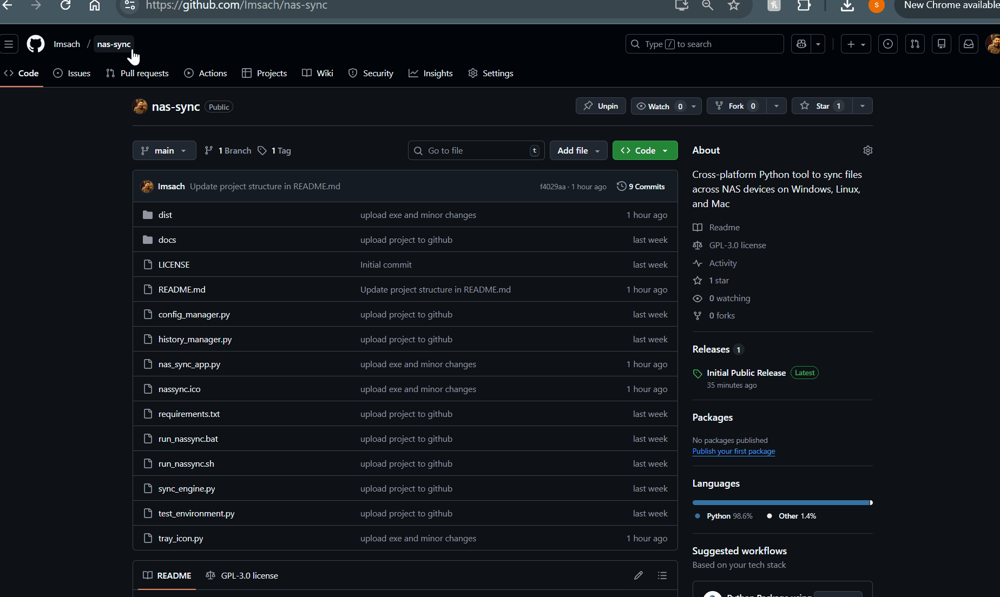
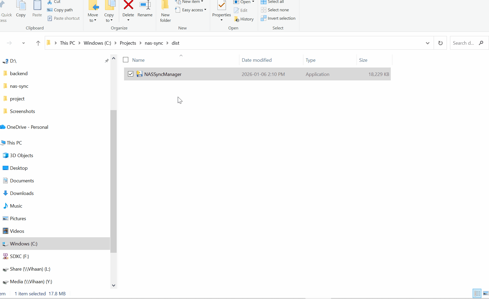

# Sync Manager

Professional automated backup solution specifically optimized for NAS devices with an elegant modern interface.


Powered by Stonklab.com(https://stonklab.com)

## Features Overview

### Core Features
- 🔄 **Automatic & Manual Sync** - Schedule automatic syncing or trigger on-demand
- 📊 **Dashboard Interface** - Modern tabbed interface with real-time statistics
- 🎯 **NAS Integration** - Auto-detects mapped drives and optimized performance
- 🔐 **MD5 Verification** - Optional file integrity verification
- 📈 **Sync History** - Complete tracking of all sync operations
- 🔔 **Notifications** - Email alerts and system tray notifications (Windows)
- ⚡ **Bandwidth Control** - Limit transfer speeds to prevent network congestion
- 🗑️ **Retention Policy** - Automatic cleanup of old backups
- 🪟 **System Tray Icon** - Windows tray integration with live progress (optional)

### Two Sync Modes
- **Mirror Mode** - Keeps destination identical to source (exact backup)
- **Copy Mode** - Only copies/updates files (preserves extra files)

## Quick Demo

<table>
<tr>
<td align="center">
<b>Launch Windows .exe</b><br>

</td>
<td align="center">
<b>Main NAS-Sync UI</b><br>

</td>
</tr>
</table>

## Quick Start

### 1. Requirements

- **Python 3.7 or higher**
- **tkinter** (usually included with Python)
- **Buffalo LinkStation** or compatible NAS device

**Optional for Windows tray icon:**
```bash
pip install pystray pillow
```

### 2. Installation

**Download and Extract** this zip file to your desired location.

**Windows:**
- Double-click `run_nassync.bat` OR 'NASSyncManager.exe' in dist directory. 

**Linux/Mac:**
```bash
chmod +x run_nassync.sh
./run_nassync.sh
```

**Or run directly:**
```bash
python nas_sync_app.py
```

### 3. First-Time Setup

1. **Configure Buffalo LinkStation OR other NAS such as FREENAS / TRUENAS**:
   - Dashboard tab → Use "Test NAS Connection"
   - Or Configuration tab → Quick Setup dropdown

2. **Set Sync Paths**:
   - Source: Your PC folder to backup
   - Destination: Your Buffalo LinkStation path

3. **Configure Options**:
   - Set sync interval (default: 30 minutes)
   - Choose sync mode (Mirror recommended for backups)
   - Configure file filters if needed

4. **Save Settings** and click **"Sync Now"** to test

5. **Enable Auto-Sync** for automatic scheduled syncing

## Documentation

- 📚 **[Quick Start Guide](docs/QUICK_START.md)** - Get started in 5 minutes
- 🎯 **[Buffalo LinkStation or NAS Guide](docs/README_BUFFALO_LINKSTATION.md)** - Complete feature documentation
- 🪟 **[Windows Features](docs/WINDOWS_FEATURES.md)** - Tray icon, history tracking, and Windows-specific features
- 📖 **[General NAS Sync Guide](docs/README_NAS_SYNC.md)** - Detailed usage instructions
- 📁 **[Files Overview](docs/FILES_OVERVIEW.md)** - Project structure guide

## Project Structure

```
nas-sync/
├── README.md                      # This file - main overview
├── nas_sync_app.py               # Main GUI application
├── sync_engine.py                # Core sync logic
├── config_manager.py             # Configuration management
├── history_manager.py            # Sync history tracking
├── tray_icon.py                  # Windows system tray icon
├── test_environment.py           # System compatibility checker
├── requirements.txt              # Optional dependencies
├── run_nassync.bat               # Windows launcher
├── run_nassync.sh                # Linux/Mac launcher
└── docs/                         # Documentation folder
    ├── QUICK_START.md            # 5-minute setup guide
    ├── README_BUFFALO_LINKSTATION.md  # Complete guide
    ├── WINDOWS_FEATURES.md       # Windows-specific features
    ├── README_NAS_SYNC.md        # General usage guide
    └── FILES_OVERVIEW.md         # Project structure details
└── dist/
    └── NASSyncManager.exe        # Windows launcher for NAS-SYNC
```

## Key Features Explained

### Dashboard Interface

5 organized tabs:
- **Dashboard** - Quick stats, actions, and recent activity
- **Configuration** - Paths, sync mode, file filters
- **Advanced** - Bandwidth, retention, emails, scheduling
- **Logs** - Detailed sync logs with color coding
- **History** - Complete sync history with statistics

### Windows System Tray Icon

Color-coded status indicators:
- 🔵 Blue: Ready/Idle
- 🟠 Orange: Syncing in progress
- 🟢 Green: Last sync successful
- 🔴 Red: Last sync failed

Right-click menu:
- Show/Hide window
- Sync Now
- Toggle Auto-Sync
- View History
- Open Logs
- Exit

### Sync History Tracking

Automatically records:
- Every sync operation with timestamp
- Files copied, updated, deleted
- Error counts and duration
- Success rate statistics
- Export capability for reporting

### Advanced Features

**Bandwidth Control:**
- Limit transfer speed (1-1000 MB/s)
- Prevents network congestion
- Ideal for large file transfers

**Retention Policy:**
- Automatically delete old backups
- Configure retention period (1-365 days)
- Manages Buffalo LinkStation storage

**Email Notifications:**
- SMTP support for any email provider
- Alerts on sync completion/failure
- Configurable in Advanced tab

**Scheduled Sync Times:**
- Run at specific times (e.g., 9 AM, 6 PM)
- Alternative to interval-based syncing
- Perfect for off-hours backups

## Configuration Examples

### Daily Document Backup
```
Source: C:\Users\YourName\Documents
Destination: Z:\Backups\Documents
Mode: Mirror
Interval: 60 minutes
Include: *
Exclude: *.tmp,~*,.DS_Store
```

### Photo Archive
```
Source: C:\Users\YourName\Pictures
Destination: Z:\Photos
Mode: Copy Only
Interval: 120 minutes
Include: *.jpg,*.png,*.raw,*.nef
Bandwidth: 20 MB/s
```

### Project Backup
```
Source: C:\Projects\MyApp
Destination: Z:\ProjectBackups
Mode: Mirror
Scheduled: 09:00,18:00
Exclude: node_modules,dist,build,*.log
Notifications: Enabled
```

## Troubleshooting

### Quick Checks

1. **Run environment test:**
   ```bash
   python test_environment.py
   ```

2. **Test Buffalo LinkStation or NAS connection:**
   - Click "Test NAS Connection" button in Dashboard

3. **Check logs:**
   - View Logs tab for detailed error messages

### Common Issues

**Can't connect to Buffalo LinkStation (OR NAS):**
- Verify NAS is powered on
- Check network drive is mapped (Windows) or mounted (Linux)
- Test with `ping LINKSTATION-IP`

**Tray icon not showing:**
```bash
pip install pystray pillow
```

**Permission errors:**
- Check folder permissions
- Verify NAS share permissions
- Run as administrator if needed

**Slow transfers:**
- Enable bandwidth limiting
- Disable file verification temporarily
- Use wired connection instead of WiFi

## Windows-Specific Setup

### Map Buffalo LinkStation or any NAS

1. Open File Explorer
2. Right-click "This PC" → "Map network drive"
3. Choose drive letter (e.g., Z:)
4. Enter: `\\LINKSTATION\share` OR `\\NAS\drive` 
5. Check "Reconnect at sign-in"

### Auto-Start on Windows

1. Open Task Scheduler
2. Create Basic Task → "NAS Sync"
3. Trigger: "At log on"
4. Action: Start program
   - Program: `pythonw.exe`
   - Arguments: `"C:\path\to\nas_sync_app.py"`
     OR
   - Program: 'NASSyncManager.exe'
5. Save and enable

## Linux/Mac Setup

### Mount Buffalo LinkStation or any NAS 

**Linux (CIFS):**
```bash
sudo mkdir -p /mnt/linkstation
sudo mount -t cifs //LINKSTATION-IP/share /mnt/linkstation -o username=user,password=pass
```

**Permanent mount (add to /etc/fstab):**
```
//LINKSTATION-IP/share /mnt/linkstation cifs username=user,password=pass 0 0
```

**Mac:**
- Finder → Go → Connect to Server
- Enter: `smb://LINKSTATION-IP/share`

## System Requirements

### Minimum
- Python 3.7+
- 512 MB RAM
- Buffalo LinkStation or compatible NAS
- Network connection

### Recommended
- Python 3.9+
- 1 GB RAM
- Gigabit Ethernet connection
- NAS with latest firmware
- Windows 10/11 (for tray icon features)

## Optional Dependencies

The application works with only Python standard library. Optional enhancements:

```bash
pip install -r requirements.txt
```

Installs:
- `pystray` - Windows system tray icon
- `pillow` - Icon image support

## Support & Help

### Getting Help

1. Check documentation in `docs/` folder
2. Run `test_environment.py` to check system
3. Review logs in Logs tab
4. Test NAS connection
5. Check NAS is online and accessible

### File Locations

- **Configuration:** `~/.nassync/config.json`
- **History:** `~/.nassync/history.json`
- **Windows:** `C:\Users\YourName\.nassync\`
- **Linux/Mac:** `/home/yourname/.nassync/`

## Safety & Best Practices

✅ **Test first** - Use a small folder before syncing important data
✅ **Mirror mode warning** - Files deleted from source will be deleted from NAS
✅ **Verify backups** - Enable file verification for important data
✅ **Monitor logs** - Check for errors regularly
✅ **3-2-1 rule** - Keep 3 copies, 2 media types, 1 offsite

## License

This software is provided as-is for personal and commercial use.

## Version History

### Version 1.0 - Initial Release (Current)
- ✨ Modern elegant UI with tabbed interface
- 🪟 Windows system tray icon with notifications
- 📊 Comprehensive sync history tracking
- ⚡ Bandwidth control and throttling
- 🗑️ Automatic retention policy
- 📧 Email notification support
- 🎯 NAS auto-detection
- 🔍 Connection testing
- 📈 Real-time progress tracking
- 🎨 Color-coded dashboard and logs
- Basic sync functionality
- Mirror and Copy modes
- File filtering
- MD5 verification
- Auto-sync capability
- Windows executable file
- Linux/MAC support

---

## Quick Command Reference

```bash
# Run the application
python nas_sync_app.py

# Test environment
python test_environment.py

# Install optional dependencies
pip install -r requirements.txt

# Windows launcher
run_nassync.bat
or
NASSyncManager.exe

# Linux/Mac launcher
./run_nassync.sh
```

---

**Enjoy hassle-free automated backups to your NAS server!** 🚀

For detailed documentation, see the `docs/` folder.
